#### 包结构
* com.seven
    * base -- 基础类 接口
    * messy -- 未使用设计模式杂乱代码
    * refactor -- 使用设计模式代码

### 设计模式
1. [工厂模式](https://bugstack.cn/itstack-demo-design/2020/05/20/%E9%87%8D%E5%AD%A6Java%E8%AE%BE%E8%AE%A1%E6%A8%A1%E5%BC%8F-%E5%AE%9E%E6%88%98%E5%B7%A5%E5%8E%82%E6%96%B9%E6%B3%95%E6%A8%A1%E5%BC%8F.html) 
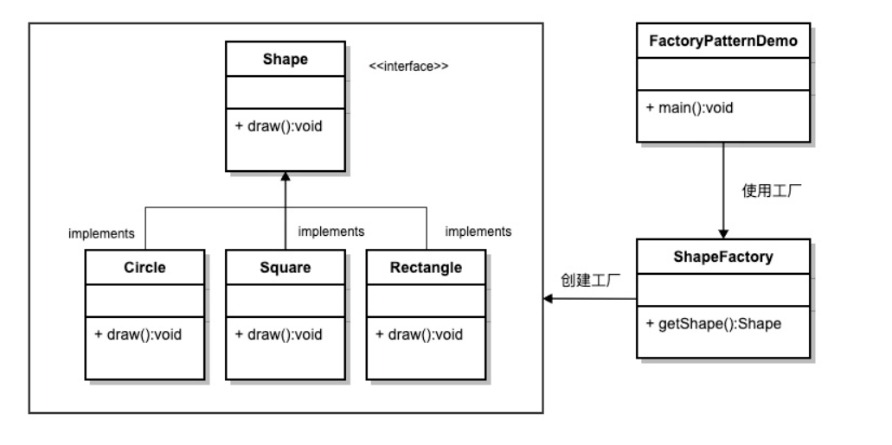

2. [抽象工厂模式](https://bugstack.cn/itstack-demo-design/2020/05/24/%E9%87%8D%E5%AD%A6Java%E8%AE%BE%E8%AE%A1%E6%A8%A1%E5%BC%8F-%E6%8A%BD%E8%B1%A1%E5%B7%A5%E5%8E%82%E6%A8%A1%E5%BC%8F.html)
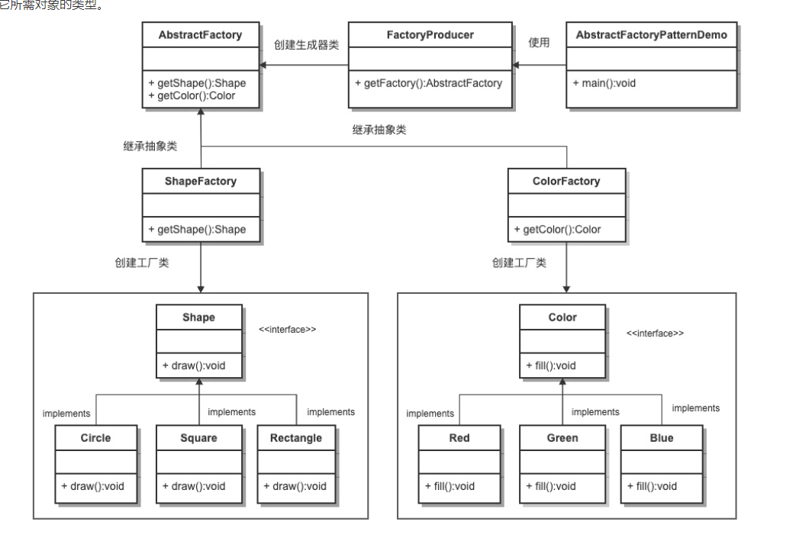

3. [建造者模式](https://bugstack.cn/itstack-demo-design/2020/05/26/%E9%87%8D%E5%AD%A6Java%E8%AE%BE%E8%AE%A1%E6%A8%A1%E5%BC%8F-%E5%AE%9E%E6%88%98%E5%BB%BA%E9%80%A0%E8%80%85%E6%A8%A1%E5%BC%8F.html)
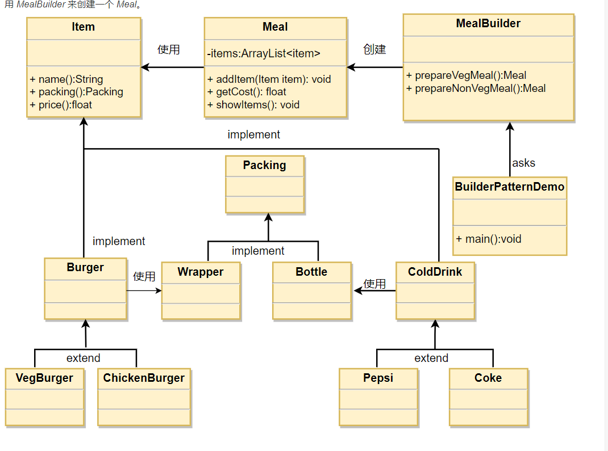

4. [原型模式](https://bugstack.cn/itstack-demo-design/2020/05/28/%E9%87%8D%E5%AD%A6-Java-%E8%AE%BE%E8%AE%A1%E6%A8%A1%E5%BC%8F-%E5%AE%9E%E6%88%98%E5%8E%9F%E5%9E%8B%E6%A8%A1%E5%BC%8F.html)
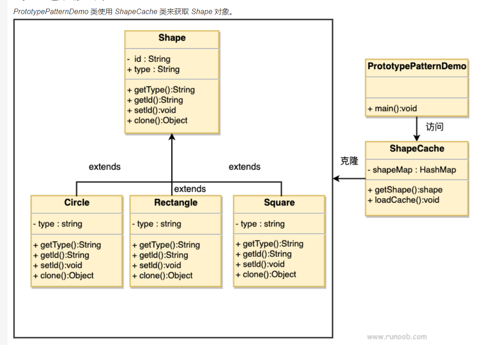

5. [单例模式](https://bugstack.cn/itstack-demo-design/2020/05/31/%E9%87%8D%E5%AD%A6-Java-%E8%AE%BE%E8%AE%A1%E6%A8%A1%E5%BC%8F-%E5%AE%9E%E6%88%98%E5%8D%95%E4%BE%8B%E6%A8%A1%E5%BC%8F.html)

6. [适配器模式](https://bugstack.cn/itstack-demo-design/2020/06/02/%E9%87%8D%E5%AD%A6-Java-%E8%AE%BE%E8%AE%A1%E6%A8%A1%E5%BC%8F-%E9%80%82%E9%85%8D%E5%99%A8%E6%A8%A1%E5%BC%8F.html)
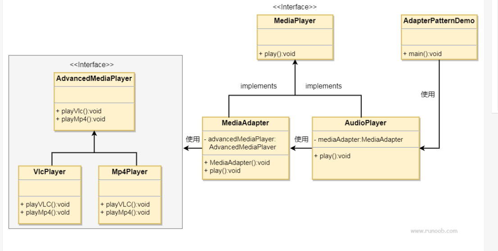

7. [桥接模式](https://bugstack.cn/itstack-demo-design/2020/06/04/%E9%87%8D%E5%AD%A6-Java-%E8%AE%BE%E8%AE%A1%E6%A8%A1%E5%BC%8F-%E5%AE%9E%E6%88%98%E6%A1%A5%E6%8E%A5%E6%A8%A1%E5%BC%8F.html)
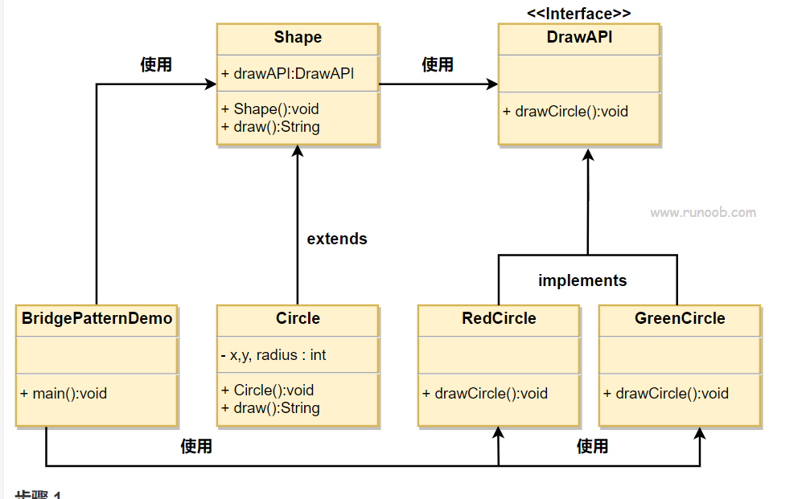

8. [组合模式](https://bugstack.cn/itstack-demo-design/2020/06/08/%E9%87%8D%E5%AD%A6-Java-%E8%AE%BE%E8%AE%A1%E6%A8%A1%E5%BC%8F-%E5%AE%9E%E6%88%98%E7%BB%84%E5%90%88%E6%A8%A1%E5%BC%8F.html)

9. [装饰器模式](https://bugstack.cn/itstack-demo-design/2020/06/09/%E9%87%8D%E5%AD%A6-Java-%E8%AE%BE%E8%AE%A1%E6%A8%A1%E5%BC%8F-%E5%AE%9E%E6%88%98%E8%A3%85%E9%A5%B0%E5%99%A8%E6%A8%A1%E5%BC%8F.html)
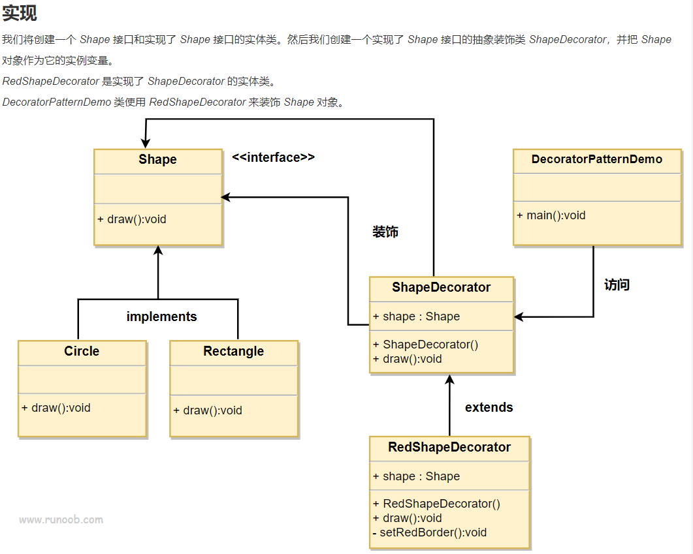

10. [享元模式](https://bugstack.cn/itstack-demo-design/2020/06/14/%E9%87%8D%E5%AD%A6-Java-%E8%AE%BE%E8%AE%A1%E6%A8%A1%E5%BC%8F-%E5%AE%9E%E6%88%98%E4%BA%AB%E5%85%83%E6%A8%A1%E5%BC%8F.html)
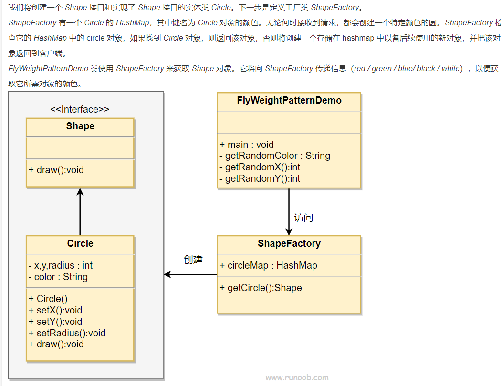

11. [外观模式](https://bugstack.cn/itstack-demo-design/2020/06/11/%E9%87%8D%E5%AD%A6-Java-%E8%AE%BE%E8%AE%A1%E6%A8%A1%E5%BC%8F-%E5%AE%9E%E6%88%98%E5%A4%96%E8%A7%82%E6%A8%A1%E5%BC%8F.html)
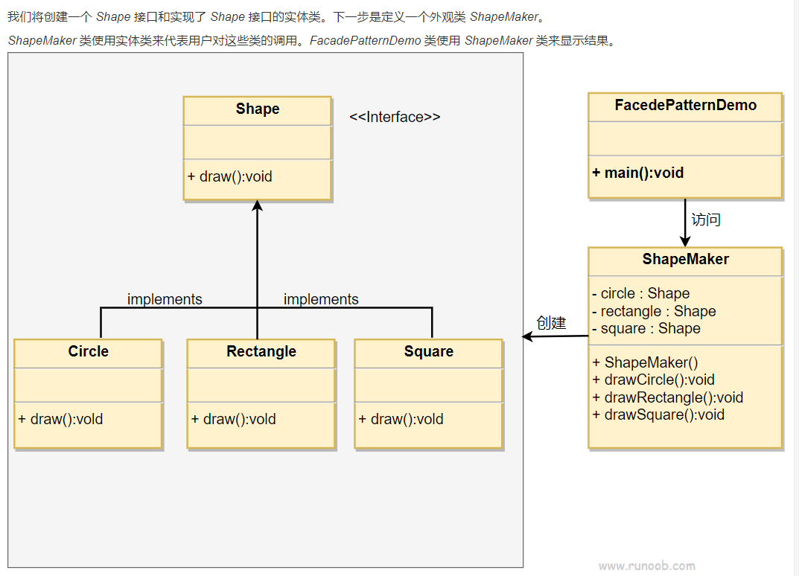

12. [代理模式](https://bugstack.cn/itstack-demo-design/2020/06/16/%E9%87%8D%E5%AD%A6-Java-%E8%AE%BE%E8%AE%A1%E6%A8%A1%E5%BC%8F-%E5%AE%9E%E6%88%98%E4%BB%A3%E7%90%86%E6%A8%A1%E5%BC%8F.html)
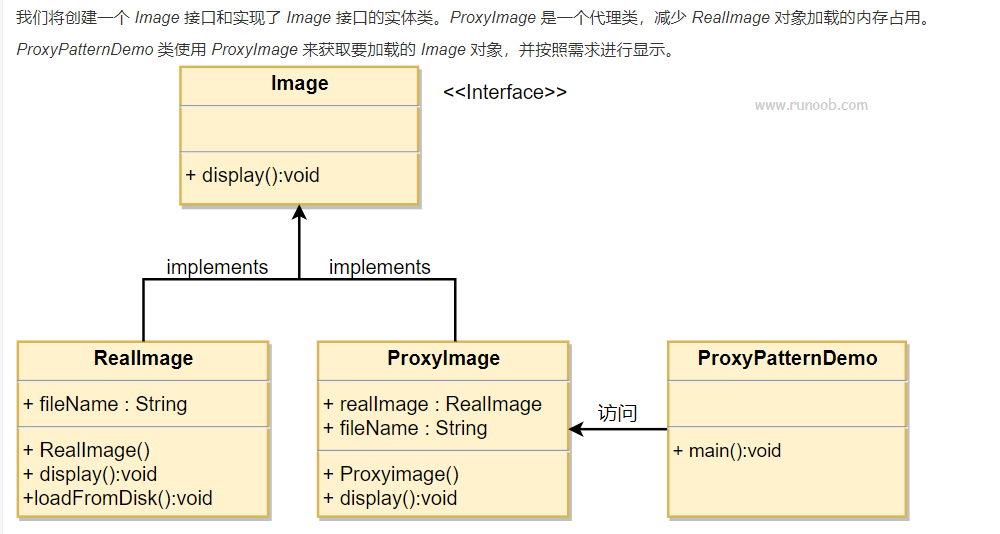

13. [责任链模式](https://bugstack.cn/itstack-demo-design/2020/06/18/%E9%87%8D%E5%AD%A6-Java-%E8%AE%BE%E8%AE%A1%E6%A8%A1%E5%BC%8F-%E5%AE%9E%E6%88%98%E8%B4%A3%E4%BB%BB%E9%93%BE%E6%A8%A1%E5%BC%8F.html)
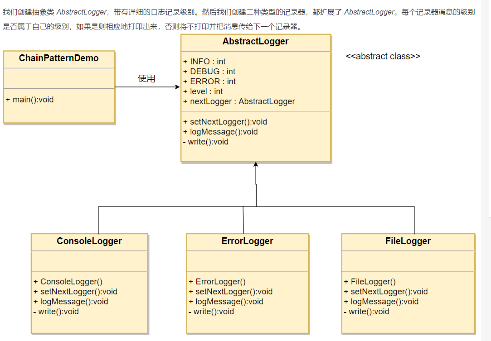

14. [命令模式](https://bugstack.cn/itstack-demo-design/2020/06/21/%E9%87%8D%E5%AD%A6-Java-%E8%AE%BE%E8%AE%A1%E6%A8%A1%E5%BC%8F-%E5%AE%9E%E6%88%98%E5%91%BD%E4%BB%A4%E6%A8%A1%E5%BC%8F.html)
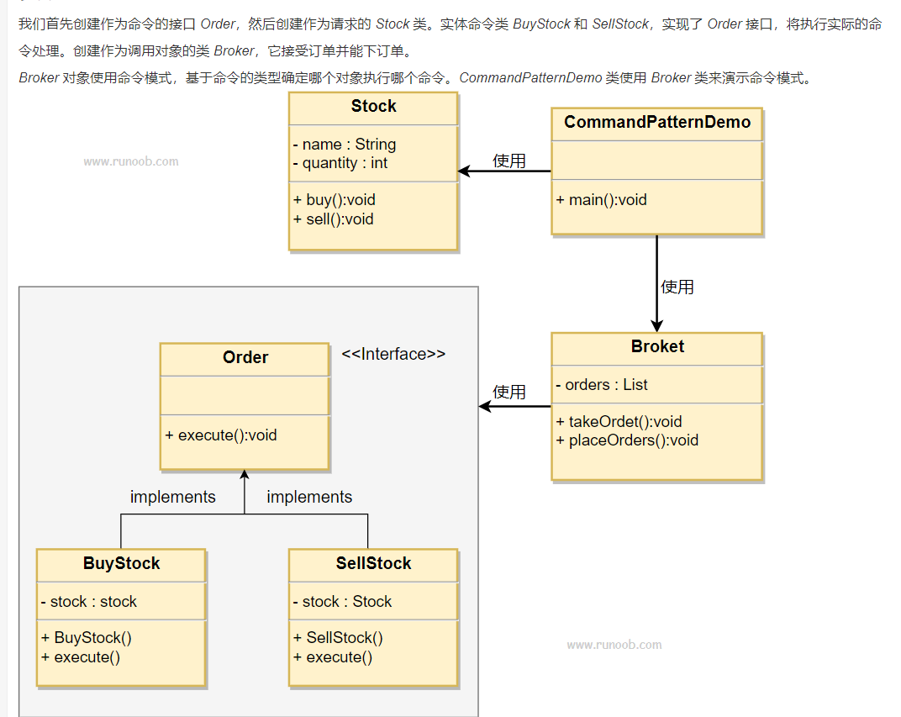

15. [迭代器模式](https://bugstack.cn/itstack-demo-design/2020/06/23/%E9%87%8D%E5%AD%A6-Java-%E8%AE%BE%E8%AE%A1%E6%A8%A1%E5%BC%8F-%E5%AE%9E%E6%88%98%E8%BF%AD%E4%BB%A3%E5%99%A8%E6%A8%A1%E5%BC%8F.html)

16. [中介者模式](https://bugstack.cn/itstack-demo-design/2020/06/27/%E9%87%8D%E5%AD%A6-Java-%E8%AE%BE%E8%AE%A1%E6%A8%A1%E5%BC%8F-%E5%AE%9E%E6%88%98%E4%B8%AD%E4%BB%8B%E8%80%85%E6%A8%A1%E5%BC%8F.html)

17. [备忘录模式](https://bugstack.cn/itstack-demo-design/2020/06/28/%E9%87%8D%E5%AD%A6-Java-%E8%AE%BE%E8%AE%A1%E6%A8%A1%E5%BC%8F-%E5%AE%9E%E6%88%98%E5%A4%87%E5%BF%98%E5%BD%95%E6%A8%A1%E5%BC%8F.html)
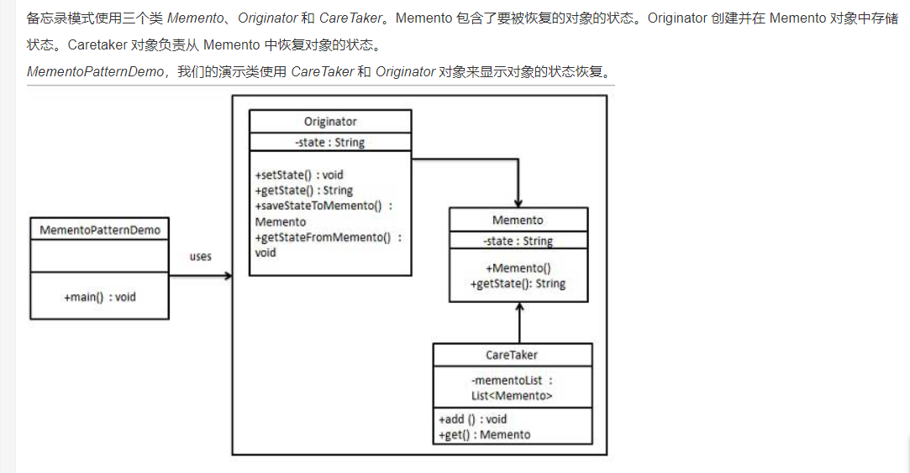

18. [观察者模式](https://bugstack.cn/itstack-demo-design/2020/06/30/%E9%87%8D%E5%AD%A6-Java-%E8%AE%BE%E8%AE%A1%E6%A8%A1%E5%BC%8F-%E5%AE%9E%E6%88%98%E8%A7%82%E5%AF%9F%E8%80%85%E6%A8%A1%E5%BC%8F.html)
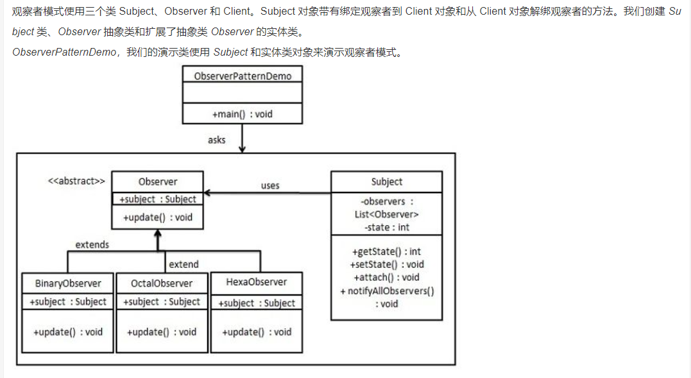

19. [状态模式](https://bugstack.cn/itstack-demo-design/2020/07/02/%E9%87%8D%E5%AD%A6-Java-%E8%AE%BE%E8%AE%A1%E6%A8%A1%E5%BC%8F-%E5%AE%9E%E6%88%98%E7%8A%B6%E6%80%81%E6%A8%A1%E5%BC%8F.html)
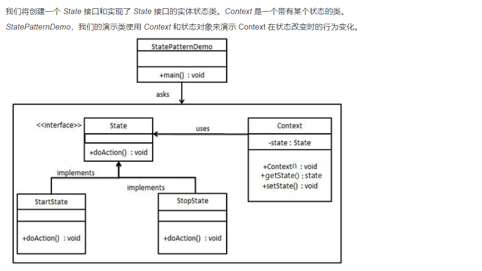

